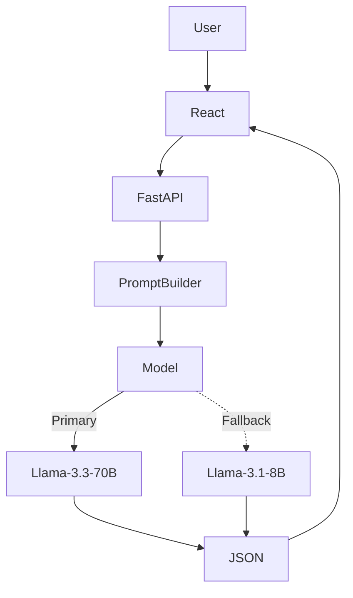

<div align="center">
      
# 🚀 AI Co-Founder

> **An AI-powered startup blueprinting engine that transforms raw ideas into validated business strategies, market insights, GTM plans, and launch-ready assets.**

[](https://ai-co-founder-pp41.vercel.app)
[](https://drive.google.com/file/d/1VOHc_kXOSLDqJVBySgX54oIFzIZMQ4w8/view?usp=sharing)
</div>

---


---

## 📖 Overview

AI Co-Founder helps founders transform startup ideas into structured business blueprints. From validating problems and analyzing competitors to generating GTM strategies, pricing recommendations, startup stress tests, and launch-ready assets, the platform automates the early-stage startup planning process using a guided AI workflow powered by **React**, **FastAPI**, and **Groq Llama models**.

---

## 📸 Preview

| Validation & Market Fit | Generated Startup |
|--------------------------|-------------------|
|  |  |

---

## ✨ Features

- 💡 **Problem Validation** – Refines startup ideas into validated business problems.
- 📊 **Market Analysis** – Generates localized business insights.
- 🏆 **Competitor Benchmarking** – Compares positioning, pricing, and strengths.
- 🚀 **Strategy Generator** – Produces Safe, Innovative, and Disruptive startup plans.
- 🧪 **Startup Stress Testing** – Simulates investor objections and customer feedback.
- 📢 **GTM Planning** – Generates pricing, launch strategy, and revenue projections.
- 🌐 **Landing Page Generator** – Creates launch-ready website copy.
- 🤖 **AI Co-Founder Chat** – Interactive AI assistant for startup brainstorming.

---

## 🔄 Workflow

```text
Startup Idea
      │
      ▼
Problem Validation
      │
      ▼
Market Analysis
      │
      ▼
Competitor Benchmarking
      │
      ▼
Strategy Generation
      │
      ▼
Startup Stress Test
      │
      ▼
GTM Planning
      │
      ▼
Landing Page
      │
      ▼
AI Co-Founder Chat
```

---

## 🏗️ Architecture



The React frontend communicates with a FastAPI backend, which routes structured prompts to Groq LLMs. Responses are validated and returned as structured JSON before rendering in the UI.

---

## 🛠️ Tech Stack

| Category | Technologies |
|-----------|--------------|
| **Frontend** | React 19, Vite, React Router v7, Tailwind CSS v4 |
| **Backend** | FastAPI, Uvicorn |
| **AI** | Groq Cloud (Llama-3.3-70B, Llama-3.1-8B) |
| **Validation** | Pydantic |
| **Charts** | Recharts |
| **Icons** | Lucide React |

---

## 📦 Installation

### Clone the repository

```bash
git clone https://github.com/<your-username>/AI-Co-Founder.git

cd AI-Co-Founder
```

### Backend

```bash
cd backend

python -m venv venv

# Windows
venv\Scripts\activate

# Linux/macOS
source venv/bin/activate

pip install -r requirements.txt
```

Create a `.env` file

```env
GROQ_API_KEY=your_groq_api_key
```

Run the server

```bash
python main.py
```

---

### Frontend

```bash
cd frontend

npm install

npm run dev
```

---

## ⚙️ Environment Variables

| Variable | Description |
|-----------|-------------|
| `GROQ_API_KEY` | Groq API Key |
| `VITE_API_BASE_URL` | Backend API URL |

---

## 📂 Project Structure

```text
AI-Co-Founder/
│
├── backend/
│   ├── main.py
│   ├── requirements.txt
│   └── .env
│
└── frontend/
    ├── assets/
    ├── components/
    ├── context/
    ├── pages/
    ├── package.json
    └── vite.config.js
```

---

## 🚀 Future Improvements

-  User Authentication
-  Persistent Startup Blueprints
-  PDF Export
-  Team Collaboration
-  Multi-language Support
-  Cloud Deployment

---

## 📄 License

Distributed under the **MIT License**. See the `LICENSE` file for more information.
