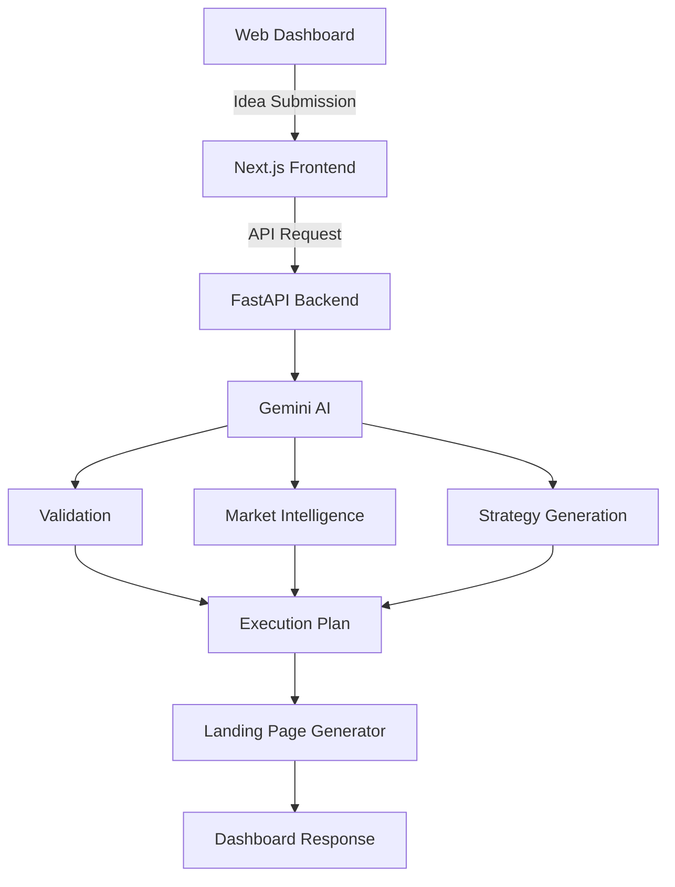
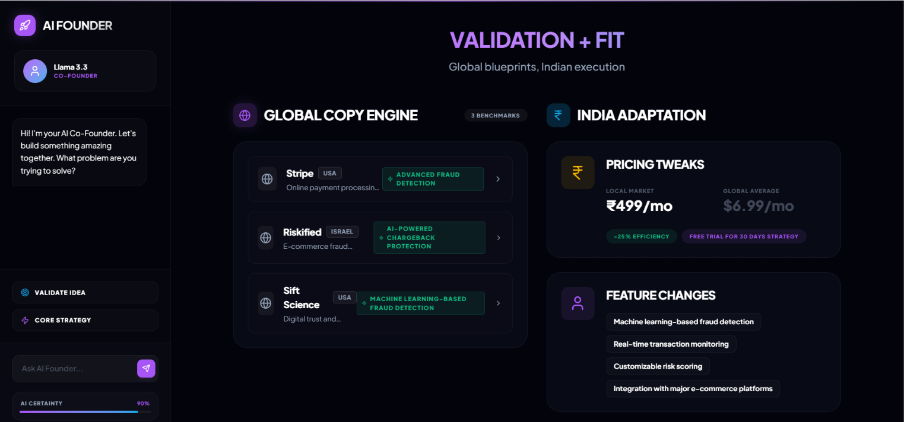
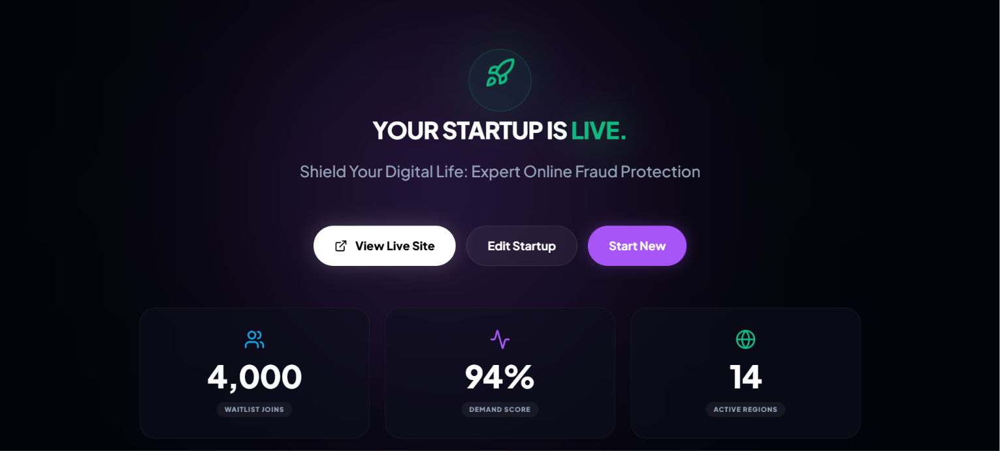

<div align="center">

# 🚀 AIFounder

**AI-powered startup validation, market intelligence, execution planning, and launch generation.**

[](https://ai-co-founder-pp41.vercel.app/)
[](https://drive.google.com/file/d/14uv7SrWkzf5ujmIkM5TUrliRgE99mIFp/view?usp=sharing)
[](https://drive.google.com/file/d/1VOHc_kXOSLDqJVBySgX54oIFzIZMQ4w8/view?usp=sharing)
[]()

</div>

---

<p align="center">

</p>

---

## 📖 Overview

AIFounder is an AI-powered startup planning platform that transforms a single business idea into a structured execution strategy.

The platform validates startup ideas, analyzes competitors and market opportunities, generates pricing and business strategies, stress-tests assumptions, and produces launch-ready assets through a guided AI workflow.

---

## ✨ Key Features

- AI-powered startup idea validation
- Market research and competitor analysis
- India-specific market adaptation
- Pricing and business model generation
- MVP planning and execution roadmap
- Startup stress testing and risk analysis
- Landing page generation
- Interactive analytics dashboard

---

## 🏗️ Architecture



---

## 🛠️ Tech Stack

| Category | Technologies |
|----------|--------------|
| **Frontend** | Next.js, React, TypeScript, Tailwind CSS |
| **Backend** | FastAPI, Python |
| **AI** | Google Gemini API |
| **Visualization** | Recharts |
| **Deployment** | Vercel |

---

## 📸 Preview

<p align="center">


</p>

---

## 🚀 Installation

<details>
<summary><strong>Run Locally</strong></summary>

```bash
git clone https://github.com/YOUR_USERNAME/AIFounder.git

cd AIFounder

npm install

npm run dev
```

Create a `.env.local` file:

```env
GEMINI_API_KEY=your_api_key
```

</details>

---

## 📂 Project Structure

```text
app/
components/
lib/
public/
screenshots/
```

---

## 📄 License

MIT
