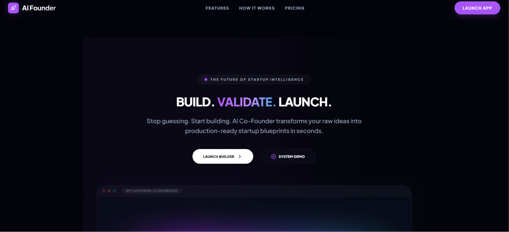

<div align="center">

# 🚀 AI Co-Founder

### Your AI Co-Founder for Building Startups That Actually Work

Transform ideas into validated, market-ready startups using AI-powered validation, market intelligence, competitive analysis, and launch planning.

[]()
[]()
[]()
[]()

</div>

---

## 📖 Overview

AI Co-Founder is an intelligent startup assistant that helps entrepreneurs validate ideas before investing time and money.

Instead of jumping straight into development, the platform analyzes market demand, studies global competitors, adapts solutions for the Indian market, simulates user feedback, predicts startup survival, and generates a launch-ready blueprint.

---

## ✨ Features

- 💡 AI-powered problem refinement
- 📊 Startup validation & market scoring
- 🌍 Global competitor intelligence
- 🇮🇳 India-specific market adaptation
- 🎯 Startup blueprint generation
- 👥 User simulation & feedback prediction
- 📈 5-Year survival analysis
- 🚀 Launch-ready landing page generation

---

## 🛠 Tech Stack

| Category | Technologies |
|----------|--------------|
| Frontend | React 19, TypeScript, Tailwind CSS |
| UI | Framer Motion, Lucide Icons |
| AI | Google Gemini API |
| Charts | Recharts |
| Deployment | Vercel |

---

## 📸 Screenshots

### 🏠 Landing Page

<p align="center">

</p>

---

### 🌍 Market Intelligence

<p align="center">

</p>

---

### 🚀 Launch Preparation

<p align="center">

</p>

---

## 🔄 Workflow

```text
Problem Statement
        │
        ▼
AI Validation
        │
        ▼
Market Intelligence
        │
        ▼
Startup Blueprint
        │
        ▼
Stress Testing
        │
        ▼
Launch Preparation
```

---

## 🚀 Getting Started

```bash
git clone https://github.com/yourusername/ai-cofounder.git

cd ai-cofounder

npm install

npm run dev
```

---

## 🎯 Future Improvements

- Multi-agent AI workflows
- Investor pitch deck generation
- Financial forecasting
- Team recommendation engine
- Startup roadmap planner
- One-click MVP generation

---

<div align="center">

**Built with ❤️ for Flipkart GRiD**

</div>
